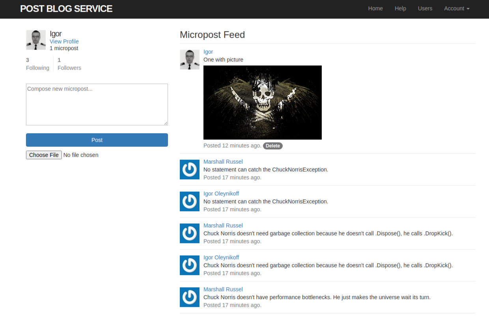

# Ruby on Rails Tutorial

## "Sample_app"

- This is the third application for the
  [_Ruby on Rails Tutorial_](https://www.railstutorial.org/)
  by [Michael Hartl](https://www.michaelhartl.com/). Sample_app!



## Getting Started

- This app is functional

## Live Demo

[Live Demo Link](https://serene-chamber-76859.herokuapp.com/)

## On your Computer

To get a local copy up and running follow these simple example steps.

## Prerequisites

- Any PC or device with an internet connection and ability to use the command
  line terminal

## Setup

- Open the command line terminal

## Install

- Go to your preferred directory
- Run `git clone https://github.com/Igors78/Sample_app.git` command
- Install Rails with all dependencies in order to run local server and app in it:
  `install Rails`
- Install gems ignoring production environment

```bash
bundle config set without 'production'
bundle install
```

- Next, migrate the database:

```bash
rails db:migrate
```

- Finally, run the test suite to verify that everything is working correctly:

```bash
rails test
```

## Usage

- If the test suite passes, you'll be ready to run the app in a local server:

```bash
rails server
```

- Open LOCALHOST:3000 in your browser
  For more information, see the
  [_Ruby on Rails Tutorial_ book](https://www.railstutorial.org/book).

## Built with

- Ruby 2.7.0
- Ruby on Rails 6.0.3.4

## Author

👤 **Igors Oleinikovs**

- GitHub: [@githubhandle](https://github.com/Igors78)
- Twitter: [@twitterhandle](https://twitter.com/oleinikovs)
- LinkedIn: [LinkedIn](https://www.linkedin.com/in/igors-oleinikovs-17a10958/)

## 🤝 Contributing

Contributions, issues, and feature requests are welcome!

## Show your support

Give a ⭐️ if you like this project!

## Acknowledgments

- Ruby documentation
- [Ruby Guides](https://www.rubyguides.com/)
- [Michael Hartl](https://www.michaelhartl.com/)

## 📝 License

This project is [UNLicense](./LICENSE) licensed.
